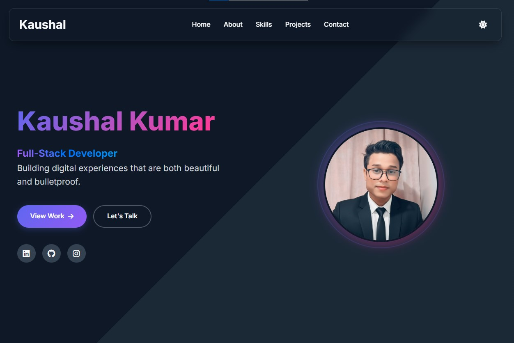

# 🚀 Modern Full-Stack Portfolio Website

A responsive and dynamic portfolio website built with the MERN stack, featuring a functional contact form with database integration and email notifications.



## 🌟 Live Demo

[**🌐 Live Portfolio**](https://kaushalprazapati.netlify.app)  
[**📦 GitHub Repository**](https://github.com/KaushalPrazapati/FUTURE_FS_01)

## 🛠️ Tech Stack

### **Frontend:**
- HTML5, CSS3, JavaScript (ES6+)
- CSS Grid & Flexbox
- Responsive Web Design
- Font Awesome Icons
- Google Fonts (Inter)

### **Backend:**
- Node.js
- Express.js
- RESTful APIs
- CORS Enabled

### **Database:**
- MongoDB Atlas (Cloud Database)
- Mongoose ODM

### **Email Service:**
- Nodemailer with Gmail SMTP
- Formspree Integration

### **Deployment:**
- Frontend: Netlify
- Backend: Render
- Database: MongoDB Atlas

## ✨ Features

- ✅ **Responsive Design** - Mobile-first approach
- ✅ **Dark/Light Theme** - Toggle with local storage
- ✅ **Contact Form** - MongoDB database integration
- ✅ **Email Notifications** - Instant email alerts
- ✅ **Smooth Animations** - CSS transitions & JavaScript
- ✅ **Project Showcase** - Filterable projects section
- ✅ **Skills Progress** - Animated progress bars
- ✅ **SEO Optimized** - Meta tags & semantic HTML

## 🚀 Quick Start

### Prerequisites
- Node.js (v14 or higher)
- MongoDB Atlas account
- Gmail account (for email notifications)

### Installation Steps

1. **Clone the repository**
```bash
git clone https://github.com/KaushalPrazapati/portfolio-website.git
cd portfolio-website

2. Install backend dependencies:
bash
cd server
npm install

3. **Set up environment variables:**
Create .env file in server directory:

env
EMAIL_USER=your_email@gmail.com
EMAIL_PASS=your_app_password
MONGODB_URI=your_mongodb_connection_string
PORT=5000
Start the development server:

bash
npm run dev
Open frontend:
Open index.html in browser or deploy to Netlify

🎯 Project Structure
text
portfolio-website/
├── index.html          # Main HTML file
├── style.css           # Stylesheet
├── script.js           # JavaScript functionality
├── images/             # All images
│   ├── profile.jpg
│   └── projects/
├── assets/             # Resume & other assets
└── server/             # Backend server
    ├── index.js        # Express server
    ├── package.json    # Dependencies
    └── .env            # Environment variables
📞 Contact Form Working
The contact form features:

MongoDB Storage - All messages saved to database

Email Notifications - Instant alerts to your Gmail

Form Validation - Client and server side validation

Loading States - User-friendly feedback

🚀 Deployment
Frontend: Deploy to Netlify (drag & drop)

Backend: Deploy to Render/Railway

Database: MongoDB Atlas cloud database

Environment Variables: Configure in deployment platform

📊 Database Schema
javascript
{
  name: String,
  email: String,
  subject: String,
  message: String,
  date: { type: Date, default: Date.now }
}
👨‍💻 Developer
Kaushal Kumar - Full Stack Developer

📧 Email: kaushalpzti@gmail.com

💼 LinkedIn: Kaushal Kumar

🐱 GitHub: KaushalPrazapati

📄 License
This project is open source and available under the MIT License.

⭐ Star this repo if you found it helpful!
